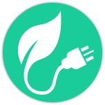
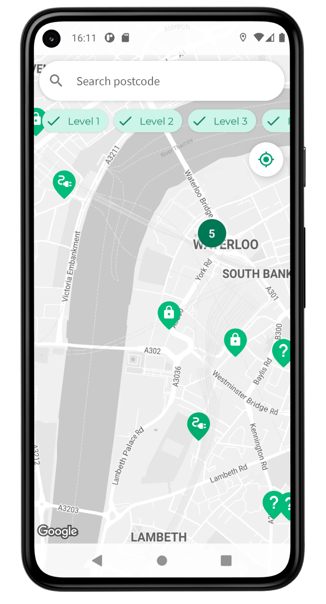
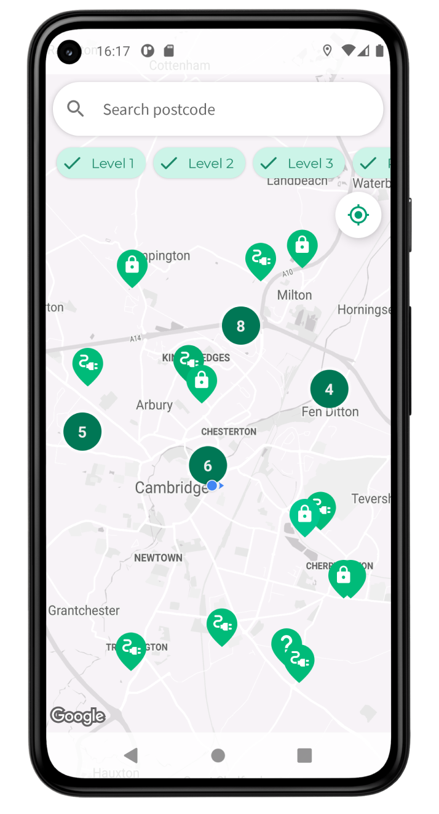
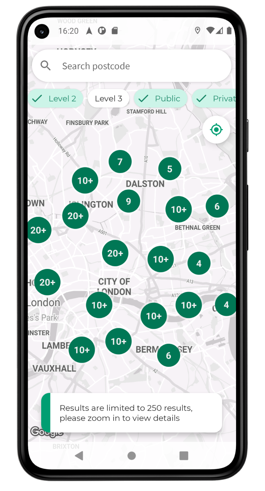
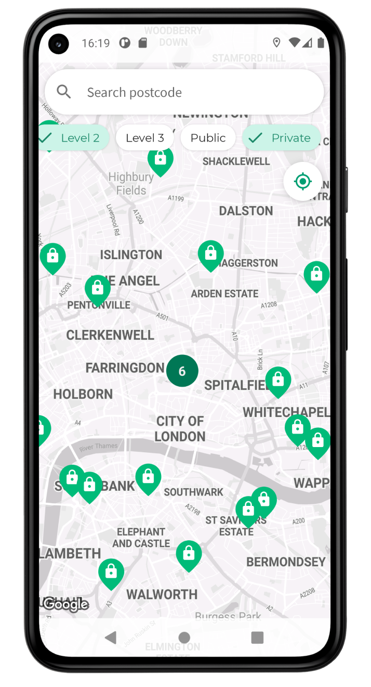
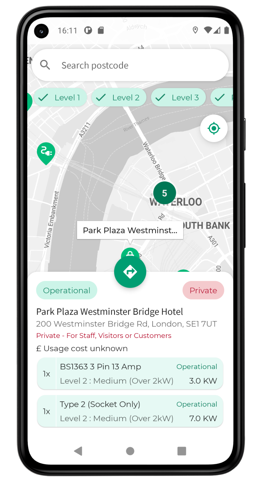
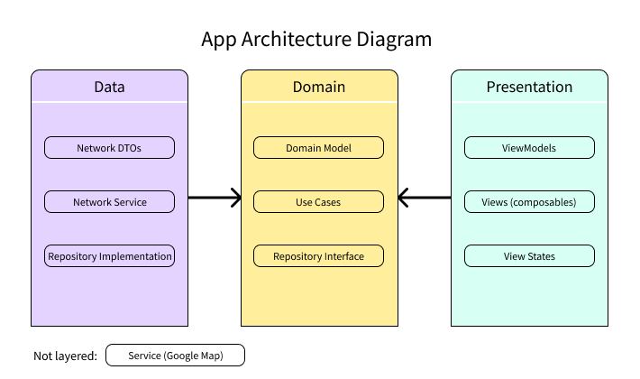
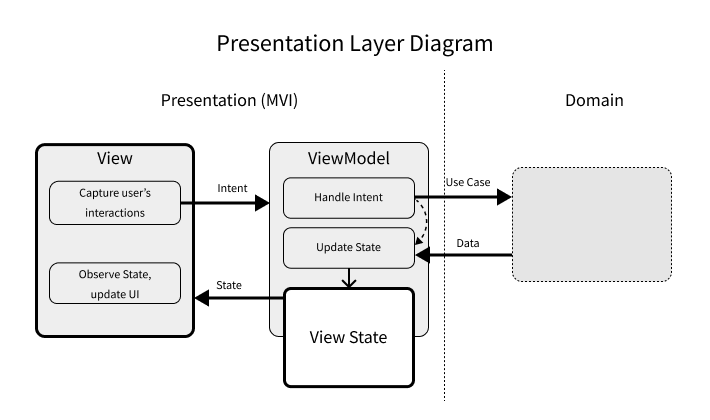

# PlugEv

## About
 This project is an Android app that uses data from Open Charge Map to display charging points for electric vehicles on a map.
Charging points are being shown based on the current displayed camera position with appropriate distance radius based on a current zoom level of a device.
Data is being re-fetched once the camera position changes. All points of interest (POIs) are displayed using custom made markers with marker clustering implemented.
The app allows to filter POIs by power level and access type, also displays a more detailed information upon selecting any particular POI using the BottomSheet.
Pressing FAB within the BottomSheet allows the user to open a turn-by-turn navigation towards a given POI.
The app also contains a handy search bar which allows to enter a postcode and move a camera towards the said destination. Postcode geolocation data is supplied by Postcodes.io.

## Screenshots




## Key Features
This app uses the latest cutting edge libraries and tools:
- 100% written in Kotlin;
- Jetpack Compose (with the exception of Google Map view and splash screen)  - the Android’s modern declarative UI toolkit;
- Kotlin Coroutines for asynchronous programming;
- Hilt for dependency injection.

Other features:
- MVI + MVVM architecture;
- Clean Architecture (structured on a package level);
- Google Maps Android SDK;
- Retrofit for consuming RESTful Apis;
- JUnit4, MockK for Unit testing (TDD approach).

## Architecture diagram
Packages in this project are structured and separated into 3 distinct layers: Domain, Data, Presentation
<p align="center">

</p>

Presentation layer uses MVI architectural pattern (based on MVVM)
<p align="center">

</p>

## Development setup
In order to clone and be able to run the code you will need to supply API Keys for the Google Maps SDK and Open Charge Map API:
- [Google Maps SDK instructions](https://developers.google.com/maps/documentation/android-sdk/get-api-key)
- [Open Charge Map instructions](https://openchargemap.org/site/develop/api)

After you've acquired API keys you should set them within the `local.properties` file in your project folder as follows:
```
googleMapsApiKey=< Google Maps SDK Api key goes here >
openChargeMapKey=< Open Charge Map Api key goes here >
```

## APIs used
- [Open Charge Map Api](https://openchargemap.org/site/develop#api) for fetching POI data;
- [Postcodes.io](https://postcodes.io/) for getting postcode geolocation data.

## License
```
PlugEv
Copyright (C) 2021  Alexei Sevcisen

This program is free software: you can redistribute it and/or modify
it under the terms of the GNU General Public License as published by
the Free Software Foundation, either version 3 of the License, or 
any later version.

This program is distributed in the hope that it will be useful,
but WITHOUT ANY WARRANTY; without even the implied warranty of
MERCHANTABILITY or FITNESS FOR A PARTICULAR PURPOSE.  See the
GNU General Public License for more details.

You should have received a copy of the GNU General Public License
along with this program.  If not, see <http://www.gnu.org/licenses/>.
```
